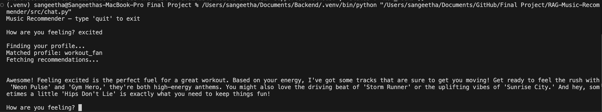
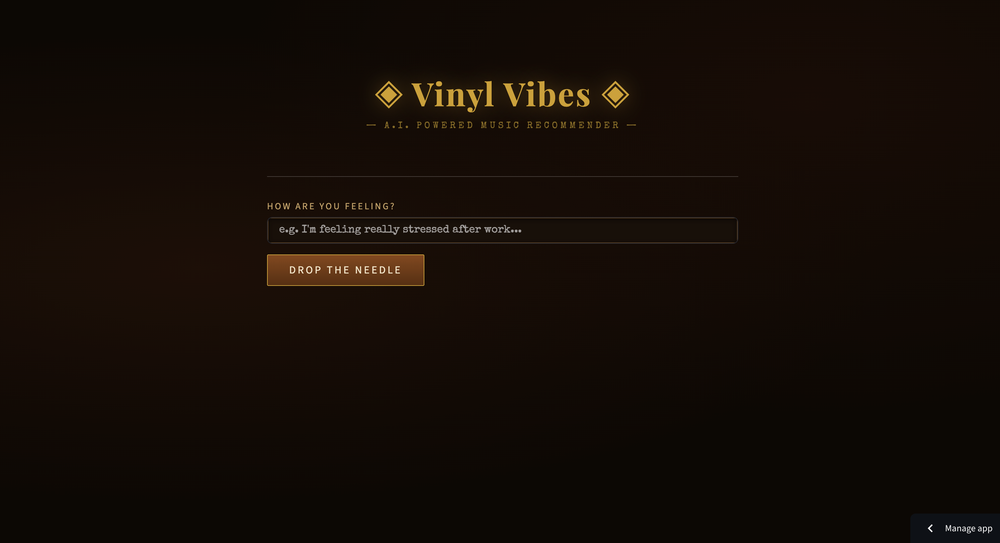
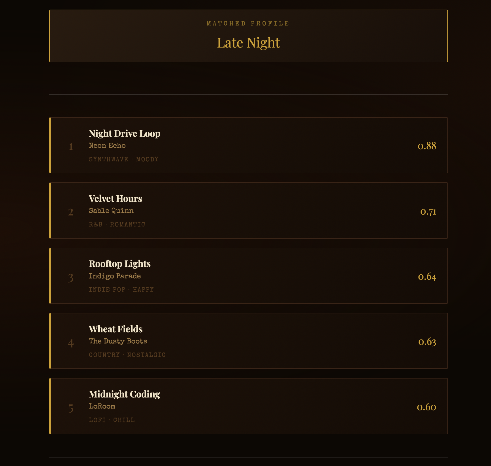
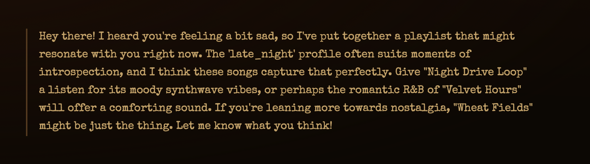

# 🎵 Music Recommender Simulation

## Project Summary

In this project you will build and explain a small music recommender system.

Your goal is to:

- Represent songs and a user "taste profile" as data
- Design a scoring rule that turns that data into recommendations
- Evaluate what your system gets right and wrong
- Reflect on how this mirrors real world AI recommenders

Replace this paragraph with your own summary of what your version does.

---

## How The System Works

Explain your design in plain language.

Some prompts to answer:

- What features does each `Song` use in your system
  - For example: genre, mood, energy, tempo
- What information does your `UserProfile` store
- How does your `Recommender` compute a score for each song
- How do you choose which songs to recommend

You can include a simple diagram or bullet list if helpful.

The main features I plan on using for the music recommender system is genre, mood and energy. Secondary features which I may use are acousticness and valence. The `UserProfile` currently stores favorite_genre, favorite_mood, target_energy, and likes_acoustic. The formula to compute a score for each song is: score = 1 - |song_value - user_preference| .

It chooses which songs to recommend after computing a score, it calculates ranking. Ranking takes the full list of songs and tells you which to play. An anology for this is scoring rule = the rubric and interviewer uses to evaluate one candidate. Ranking rule is when the hiring committee decides who gets an offer based on all the scores. 

I am going to approach a numeric first approach for the weights. 
Numeric-First (best for precision)
  "weights": {
      "energy":       0.30,
      "acousticness": 0.25,
      "tempo":        0.20,
      "mood":         0.15,   # tiebreaker
      "genre":        0.10,   # soft filter
  }

.sort() vs sorted()
.sort()	sorted()
Operates on	The list in-place	Returns a new list
Original list	Mutated	Unchanged
Returns	None	A new sorted list
Works on	Lists only	Any iterable

# .sort() — mutates scored, returns None
scored.sort(key=lambda x: x[1], reverse=True)
top = scored[:k]  # original list is now sorted

# sorted() — leaves scored untouched, returns new list
ranked = sorted(scored, key=lambda x: x[1], reverse=True)
top = ranked[:k]
sorted() is the Pythonic choice here because scored is a temporary list we don't need to preserve, but the real reason to prefer it is clarity — it makes the data flow explicit: scored goes in, ranked comes out, no side effects.

The key=lambda x: x[1] tells Python to sort by the second element of each tuple — the score — and reverse=True puts the highest score first.


---

## Getting Started

### Setup

1. Create a virtual environment (optional but recommended):

   ```bash
   python -m venv .venv
   source .venv/bin/activate      # Mac or Linux
   .venv\Scripts\activate         # Windows

2. Install dependencies

```bash
pip install -r requirements.txt
```

3. Run the app:

```bash
python -m src.main
```

### Running Tests

Run the starter tests with:

```bash
pytest
```

You can add more tests in `tests/test_recommender.py`.

---

## Experiments You Tried

Use this section to document the experiments you ran. For example:

- What happened when you changed the weight on genre from 2.0 to 0.5
- What happened when you added tempo or valence to the score
- How did your system behave for different types of users

---

## Limitations and Risks

Summarize some limitations of your recommender.

Examples:

- It only works on a tiny catalog
- It does not understand lyrics or language
- It might over favor one genre or mood

You will go deeper on this in your model card.

---

## Reflection

Read and complete `model_card.md`:

[**Model Card**](model_card.md)

Write 1 to 2 paragraphs here about what you learned:

- about how recommenders turn data into predictions
- about where bias or unfairness could show up in systems like this


---

## 7. `model_card_template.md`

Combines reflection and model card framing from the Module 3 guidance. :contentReference[oaicite:2]{index=2}  

```markdown
# 🎧 Model Card - Music Recommender Simulation

## 1. Model Name

Give your recommender a name, for example:

> VibeFinder 1.0

---

## 2. Intended Use

- What is this system trying to do
- Who is it for

Example:

> This model suggests 3 to 5 songs from a small catalog based on a user's preferred genre, mood, and energy level. It is for classroom exploration only, not for real users.

---

## 3. How It Works (Short Explanation)

Describe your scoring logic in plain language.

- What features of each song does it consider
- What information about the user does it use
- How does it turn those into a number

Try to avoid code in this section, treat it like an explanation to a non programmer.

---

## 4. Data

Describe your dataset.

- How many songs are in `data/songs.csv`
- Did you add or remove any songs
- What kinds of genres or moods are represented
- Whose taste does this data mostly reflect

---

## 5. Strengths

Where does your recommender work well

You can think about:
- Situations where the top results "felt right"
- Particular user profiles it served well
- Simplicity or transparency benefits

---

## 6. Limitations and Bias

Where does your recommender struggle

Some prompts:
- Does it ignore some genres or moods
- Does it treat all users as if they have the same taste shape
- Is it biased toward high energy or one genre by default
- How could this be unfair if used in a real product

---

## 7. Evaluation

How did you check your system

Examples:
- You tried multiple user profiles and wrote down whether the results matched your expectations
- You compared your simulation to what a real app like Spotify or YouTube tends to recommend
- You wrote tests for your scoring logic

You do not need a numeric metric, but if you used one, explain what it measures.

---

## 8. Future Work

If you had more time, how would you improve this recommender

Examples:

- Add support for multiple users and "group vibe" recommendations
- Balance diversity of songs instead of always picking the closest match
- Use more features, like tempo ranges or lyric themes

---

## 9. Personal Reflection

A few sentences about what you learned:

- What surprised you about how your system behaved
- How did building this change how you think about real music recommenders
- Where do you think human judgment still matters, even if the model seems "smart"

---
```

## Demo


## Vinyl Vibes: RAG Music Recommender
<!-- Title and Summary: What your project does and why it matters. -->
## Architecture Overview: A short explanation of your system diagram.
Diagram of my RAG Recommender System:


RAG: Retrieval Augmented Generation

## Setup Instructions: Step-by-step directions to run your code.
   ```bash
   python -m venv .venv
   source .venv/bin/activate      # Mac or Linux
   .venv\Scripts\activate         # Windows


```bash
pip install -r requirements.txt
```

3. Run the app:

```bash
python -m src.main
```

```bash
pip install google-genai
```
You can run the following code in terminal to test if Gemini works: 
python -c "
from google import genai
from dotenv import load_dotenv
import os
load_dotenv()
client = genai.Client(api_key=os.getenv('GEMINI_API_KEY'))
response = client.models.generate_content(model='gemini-2.5-flash-lite', contents='Say hello')
print(response.text)
"

## Sample Interactions: 
<!-- Include at least 2-3 examples of inputs and the resulting AI outputs to demonstrate the system is functional. -->









## Design Decisions: 
<!-- Why you built it this way, and what trade-offs you made. -->
I wanted to build a recommender system using RAG. I chose to make a web application (using Streamlit) so it would be user friendly. This would allow non-technical users to be comfortable, rather than making them run it through the command line. 

## Testing Summary: 
<!-- What worked, what didn't, and what you learned. -->
Five automated tests in `tests/test_recommender.py` cover the core scoring and retrieval logic. All five pass consistently.

**What worked:** The scoring pipeline handled edge cases well — conflicting profiles, out-of-range tempo values, unknown genres, and empty preference lists all returned valid results without crashing.

**What didn't:** Early Gemini integration was blocked by API quota limits on the free tier. Switching models (`gemini-2.0-flash` → `gemini-2.5-flash-lite`) and adding error guardrails resolved this.

**What I learned:** Testing the rule-based retrieval layer independently from the AI layer made debugging much easier. When Gemini failed, the recommender still worked — which confirmed the two layers were properly separated.


## Reflection: 
<!-- What this project taught you about AI and problem-solving. -->

This project taught me how guardrails are important. Although I am just recommending music in this particular project; LLMs being released should have multiple guardrails. 

## Future Work
Currently, a csv of songs is stored under 'data/songs.csv'. My future goals of this application is to either incorporate Spotify API for songs or use a vector database of songs. 